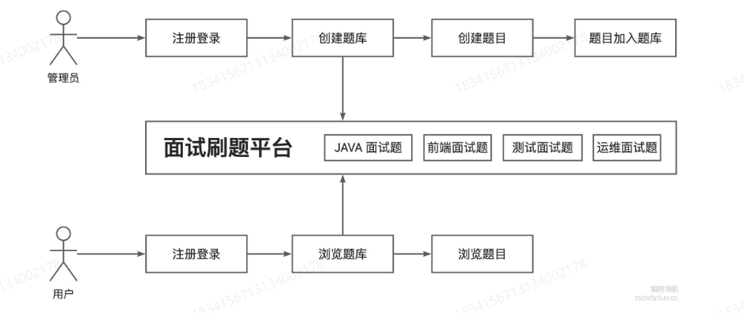

## 需求设计

### 基础功能
用户模块：用户注册、登录、管理员、增删改查
题库模块
题目模块

### 高级功能
题目的批量管理
分词题目搜索(es)
用户刷题记录日历图（bitmap）
自动缓存热门题目（热key，多级缓存）
流量控制和熔断（限流、熔断，sentail）
动态IP白名单过滤（nacos配置中心）
同端登录冲突检测
分级题目反爬虫

需求要梳理清楚，然后确定每条需求的优先级，按需实现

## 数据库表设计

## 后端代码初始化
1、使用万用模板
2、修改 springboot-init 为对应项目名字（dong-mianshiya-backend）
3、全局修改报名 com.yupi (com.dong)
4、全局替换com.dong.springbootinit 为对应项目包名（com.dong.mianshiya）
5、移出不需要的模块
6、执行初始化脚本、配置修改

### mybatisX生成代码

安装mybatisx插件
在右侧连接数据库，打开对应的数据库，选中数据表
右键选择mybatisx生成代码
生成代码后，将其移动到对应的位置

注意点：
1、数据库的自增ID调整为雪花算法
2、数据库的逻辑删除字段增加注解

### 业务代码生成
使用generate文件夹内的程序，生成业务代码
注意更换参数为对应的业务参数
由于万用模版使用的是帖子功能，包含了帖子的点赞和收藏功能，注意把这些去除

这里的结果就是保证代码可以跑起，打开/api/doc.html，查看接口文档

### 调试接口
1、修改业务代码，使得接口正常

